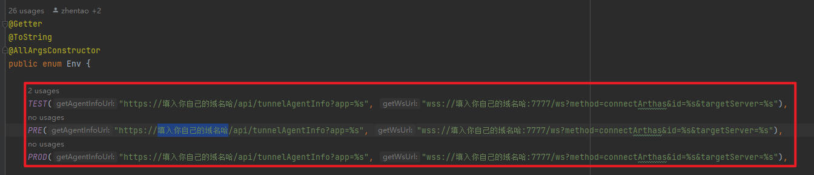

# arthas-plugin-plus

## 简介
本插件旨在简化arthas调试步骤，解决需要使用arthas-console网页进行调试的痛点。

## 使用流程
1. 修改成自己的服务器地址,编译打包
2. 打开java文件，在方法上右键，显示“Arthas Command Plus”,此步可以参考arthas-idea插件的使用，基本上是一样的
3. 弹窗中选择模块名和环境，这块会根据文件位置和git分支名字帮您默认选中当前的模块和环境，一般情况下无需手动选择
4. 点击执行按钮，打开一个命令行，稍等片刻后，会出现一个命令“xxx listening...”，证明已经成功监听了，如果这个服务有多个agent节点，会自动全部监听，这样你会看到多条"xxx listening..."，属于正常现象
5. 然后你就可以开始调试了，比如用postman发送请求，如果agent监听到，就会在命令行窗口输出对应的内容，这一块和之前使用的arthas-console基本上一致
6. 如果想要暂停，可以关掉tab，或者点击左侧工具栏中的停止按钮，这样就会停止监听
7. 如果想要重新开发监听，可以点击左侧工具栏中的重新监听按钮
8. 如果想要清除命令行上打印的记录，可以点击左侧工具栏中的垃圾桶，删除记录

## 常见问题

1. 点击执行，右下角弹出找不到agent。这是因为，现在的模块名是读取了pom文件下的artifactId标签内容，所以可能存在模块名和arthas应用名字不匹配的情况。解决方法是把artifactId改成可以匹配的，并保存，即可解决问题。